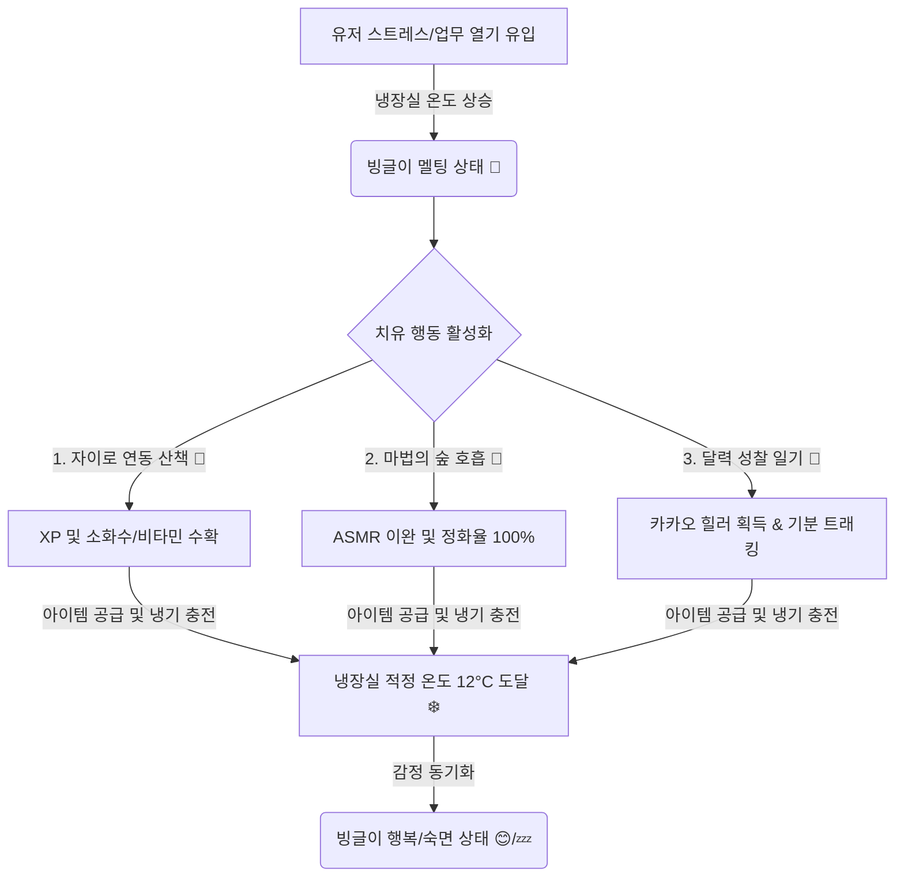

# 🧊 마음 냉장고 BINGLE (빙글) 서비스 개발 현황 보고서
> **정서 조절 & 행동 활성화 디지털 테라피 플랫폼 (DTx) 개발 성과 요약**

본 보고서는 스트레스 관리 및 정서 이완을 위한 디지털 치료제 플랫폼 **마음 냉장고 BINGLE (빙글)**의 기획 콘셉트, 핵심 서비스 구현 내용, 디자인 시스템(Stitch Design System), 그리고 데이터 동기화 및 기술 아키텍처를 상세하게 정리한 문서입니다.

---

## 📂 목차
1. [기획 의도 및 핵심 콘셉트](#1-기획-의도-및-핵심-콘셉트)
2. [BINGLE 핵심 7대 서비스 화면 상세 분석](#2-bingle-핵심-7대-서비스-화면-상세-분석)
3. [Stitch 만화책 디자인 시스템 요소](#3-stitch-만화책-디자인-시스템-요소)
4. [기술 아키텍처 및 데이터 동기화](#4-기술-아키텍처-및-데이터-동기화)
5. [개발 진척도 및 향후 계획](#5-개발-진척도-및-향후-계획)

---

## 1. 기획 의도 및 핵심 콘셉트

### 1.1 스트레스의 시각화: 녹아내리는 얼음 요정
* **기획 배경**: 현대인의 일상적 스트레스와 업무 번아웃은 눈에 보이지 않아 스스로 관리하기 어렵습니다. BINGLE은 이러한 내면의 열기를 **"냉장실 온도 상승"**과 **"얼음 요정 빙글이의 용해(Melting) 과정"**으로 유쾌하고 직관적이게 시각화했습니다.
* **코어 루프**: 유저의 스트레스와 업무 집중도가 가중될수록 냉장고 내부 온도가 상승(최대 100°C)하여 빙글이가 녹기 시작합니다. 유저는 일상적인 웰니스 행동 미션(산책, 심호흡, 성찰 일기)을 실천함으로써 시원한 **마찰 온기 에너지(XP)**와 **냉각 치유 간식**을 얻어 냉장실 기온을 다시 아늑한 적정 온도(**12°C**)로 안정시킵니다.

### 1.2 서비스 아키텍처 흐름도


---

## 2. BINGLE 핵심 7대 서비스 화면 상세 분석

현재까지 완성도 높게 개발 완료된 BINGLE의 7가지 핵심 모듈과 인터랙티브 스크린은 다음과 같습니다.

### ① 탄생 스토리 온보딩 (Story Onboarding)
* **3D 인터랙티브 냉장고 문 열기**:
  * 화면 진입 시, 굳게 닫힌 빈티지 냉장고의 전면부가 등장합니다.
  * 냉장고 문에는 실시간 기온 계기판(85°C 🥵), 아기자기한 마그넷, 포스트잇 일일 목표 메모가 부착되어 높은 비주얼 몰입감을 줍니다.
  * **"냉장실 문 열고 빙글이 구하기"** 버튼을 누르면, **Framer Motion 3D 회전 물리효과**를 통해 냉장고 양문이 시원한 얼음 안개와 함께 좌우로 열리며 곤히 잠자는 빙글이가 노출됩니다.
* **4컷 만화 스토리보드**:
  * 문이 열린 뒤, 귀여운 **"Stitch" 손그림 스타일 4컷 만화** 시퀀스가 동적으로 전개됩니다.
  * 불안해하던 얼음 요정 빙글이가 유저를 만나 온기를 나누고 세상 밖으로 모험을 떠나는 과정을 한 편의 웹툰처럼 가독성 있게 전달합니다.

### ② 아늑한 냉각 조종석 홈 (Game Hub)
* **스마트 냉장실 콕핏 (Dashboard)**:
  * 빙글이의 생활 공간인 냉장고 내부를 그대로 스마트 기기에 모사한 핵심 허브입니다.
  * 상단에 **LEVEL 계급과 마찰 온기 에너지(XP) 프로그레스 바**가 직관적으로 배치되어 유저의 웰니스 성장 척도를 한눈에 보여줍니다.
* **스마트 포커스 센터 (Smart Focus Center - 뽀모도로)**:
  * 업무를 시작할 때 냉장고 문을 활짝 열어(Open-Door) 온기를 의도적으로 유입시키는 집중 메커니즘입니다.
  * 집중 타이머가 돌아가는 동안 외부 열풍이 들어와 냉장실 온도가 초당 2.5°C씩 상승하여 빙글이가 더워합니다.
  * 집중 시간을 안전하게 완수하면 **대량의 보상(XP +50, 탄산 소화수 2개, 라벤더 우유 1개)**을 받고 빙글이를 완벽한 평온의 온도(12°C)로 냉각시켜 잠재울 수 있습니다.
* **Insta-View 버블 윈도우**:
  * 문을 닫아 집중을 끄고 휴식을 취할 때도, 냉장고 우측 도어의 동그란 버블 창을 통해 냉장고 내부에서 둥둥 떠다니며 평온하게 숨 쉬고 있는 빙글이의 실시간 애니메이션 모션을 감상할 수 있습니다.
* **독립 벡터 연구실 (Bingle Vector Lab)**:
  * BINGLE의 독자적인 SVG 물리 가속 엔진을 이용해, 감정에 따라 출렁이고 탱글탱글하게 반응하는 빙글이의 4가지 감정 상태(기쁨 😊, 숙면 💤, 분노 😤, 피로 🥵) 오리지널 벡터 점토 모델을 클로즈업해서 구경할 수 있는 가상 도감 모달입니다.

### ③ 치유 식재료 창고 (Pantry Warehouse)
* **5대 맞춤형 웰니스 치유 간식**:
  * 유저의 다양한 인지적·정서적 어려움에 효과적으로 대응할 수 있도록, 심리학적 효과가 설계된 고유 아이템 시스템입니다.
  
| 아이템 아이콘 | 아이템 명칭 | 웰니스 분류 | 치료 및 완화 효과 | 획득 방법 |
| :---: | :---: | :---: | :--- | :--- |
| 💧 | **탄산 마음 소화수** | 불안 해소 | 즉시 불안감을 탄산처럼 날리며 기온 **-15°C** 감소 | 마법의 숲 호흡 / 산책 500보 돌파 |
| 🍊 | **활력 자몽 비타민** | 무기력 극복 | 처진 의욕을 깨워내며 보너스 경험치 **+30 XP** 지급 | 산책 1200보 완주 |
| 🍫 | **번아웃 카카오 힐러** | 스트레스 진정 | 번아웃 열기를 증발시키고 완벽한 안정 온도 **12°C**로 직행 | 달력 성찰 일기 작성 |
| 🍈 | **회복 멜론 젤리** | 평온 회복 | 정서적 상처를 메우며 기온 **-10°C** & **XP +15** 획득 | 마법의 숲 정화 성공 |
| 🥛 | **꿀잠 라벤더 우유** | 수면 케어 | 복잡한 생각 회로를 멈추고 **기온 -20°C** 및 **빙글이 숙면(Sleep)** 유도 | 집중 포커스 세션 완수 |

* **냉장고 3단 선반 레이아웃**:
  * 1층(수분 밸런스), 2층(의욕 자극), 3층(번아웃 & 숙면)으로 정갈히 구분된 냉장고 문 선반 랙을 손그림 만화 형태로 아름답게 렌더링했습니다.

### ④ 김서림 달력일기 & 시각 트래커 (Calendar Diary & Stats)
* **폴라로이드 앨범 감성 일기장**:
  * 김서림이 서린 듯 아늑하게 번지는 모바일 일기 트래커입니다.
  * 매일의 기분(5개 척도)과 성찰 내용을 기록하면 그날의 마음 분위기를 상징하는 4종의 고화질 수채화풍 포스트카드 일화 스티커(`🏞️ 힐링 숲의 숨결`, `🥛 라벤더 우유`, `🏖️ 차가운 파도`, `🕯️ 명상의 촛불`)를 사진첩에 박아 보관합니다. 일기를 쓰면 [카카오 힐러 🍫]가 인벤토리에 자동 적립됩니다.
* **월별 정서 시각 통계 (Stats Dashboard)**:
  * **마음 온도 흐름 그래프**: SVG 패스를 이용해 5월 내내 요동치던 스트레스의 최고조 지점(업무 마찰이 있던 5월 15일 48°C)과 냉각이 잘 되어 평온을 찾은 하향 안정 구간을 세련된 커브 곡선으로 모니터링합니다.
  * **일별 걸음 수 변동 차트**: 3D 만화 스타일의 바 차트로 매일의 신체 활동 활성화(Behavioral Activation) 궤적을 직관적으로 보여줍니다.
  * **빙글이의 맞춤 처방전**: 유저의 한 달간 축적된 기분, 온도, 산책 수치 데이터를 빙글이 캐릭터가 종합 인지하여 파트너에게 다스림을 건네는 따뜻한 문장 피드백 영역입니다.

### ⑤ 자이로 & GPS 연동 산책 지도 (Map Walk)
* **모바일 하드웨어 센서 캘리브레이션**:
  * GPS 위성 신호 정렬, 3축 자이로센서 중력 공명 보정, 지자기 센서 궤도 매핑을 시각적인 프로그레스 바와 로그를 통해 역동적으로 보여주며 기기 연동의 고도화된 감각을 연출합니다.
* **실시간 HTML5 캔버스 산책로**:
  * 유저의 걸음 수에 맞춰, 보들보들하고 굵직한 점선으로 그려진 산책 지도 트레일을 따라 실시간으로 아장아장 걸어가는 빙글이 아이콘의 궤적을 캔버스 물리 드로잉 기법으로 직접 구현했습니다.
* **산책 마일스톤 체크포인트**:
  * `산들바람 고개 (500보)` 도달 시 탄산수 1캔 및 XP 25 수확.
  * `빙하 정상 (1200보)` 도달 시 자몽 비타민 1개 및 XP 35 수확하여 운동 자발성을 재미있게 유도합니다.

### ⑥ 마법의 숲 자연 몰입 (Forest World)
* **심호흡 가이드 숲**:
  * 복잡하게 뒤엉킨 뇌파를 맑은 숲속 바람으로 정화하는 명상 쉼터입니다.
  * 둥글고 커다란 호흡 유도 코어가 수축하고 팽창하는 애니메이션에 맞춰 심호흡을 5회 수행하면 바람 정화율 100%가 달성되며 평온 젤리를 수확합니다.
* **자연의 소리 ASMR 공명**:
  * 숲속의 맑은 바람 소리와 산새들이 지저귀는 입체적인 힐링 자연 ASMR 사운드트랙 재생 모듈을 탑재하여 깊은 청각적 이완을 제공합니다. 

### ⑦ 이웃 냉장고 소셜 지원 (Neighbors Fridge)
* **꽁꽁 가디언즈 공동체**:
  * 다른 유저(이웃)의 냉장실 상태를 엿보고 맑은 냉기나 시원한 소화수를 건네어 서로의 빙글이가 녹지 않도록 수호해 주는 정서적 지지 기반의 소셜 상호작용 플랫폼입니다.

---

## 3. Stitch 만화책 디자인 시스템 요소

BINGLE은 유저에게 따뜻하고 친근감을 선사하기 위해 **"Stitch (스티치)" 핸드드로잉 만화책 디자인 시스템**을 엄격히 계승하여 시각적 프리미엄을 완수했습니다.

* ** harmonic 파스텔 배색 가이드**:
  * 기본 배경 및 로비: 감성적인 개나리 옐로우 (`#ffcb2f`), 부드러운 코랄 오렌지 (`#ff8c69`), 은은한 살구빛 크림 (`#fdf8f5`)을 주조색으로 삼아 병원/클리닉 느낌의 차가운 화이트를 배제하고 아늑한 방구석 느낌을 극대화했습니다.
  * 냉장실 내부: 아늑한 네온 민트 및 에메랄드 스카이블루 계열을 활용해 냉각 에너지를 직관적으로 묘사했습니다.
* **볼드 테두리 (Black Border, 3px~8px)**:
  * 모든 버튼, 카드 패널, 냉장고 하우징에 만화 작가가 손으로 직접 펜 드로잉을 한 것과 같은 **두껍고 강렬한 획(Sturdy Black Borders)**을 처리하여 레트로하면서도 명확한 만화책 스타일을 정립했습니다.
* **하프톤 패턴 (Halftone Pattern Background)**:
  * 신문 만화책 인쇄 기법인 미세한 도트 망점(Halftone dots) 효과를 CSS 배경 클래스로 은은하게 투영하여 입체적이고 세련된 카툰 텍스처를 선사합니다.
* **종이 질감 3D 그림자**:
  * 평면적인 플랫 UI 대신, 오른쪽 아래로 검은색 단색 섀도우가 `3px~8px` 돌출되는 만화 스타일 입체 박스 모델(`shadow-[5px_5px_0_0_#000]`)을 전폭 적용하여 탭할 때마다 실제로 종이가 쫀득하게 눌리는 듯한 피드백을 전달합니다.

---

## 4. 기술 아키텍처 및 데이터 동기화

마음 냉장고 BINGLE의 프론트엔드와 실시간 서버 연동을 위해 견고하고 반응성이 뛰어난 경량 서버리스 데이터 아키텍처를 설계했습니다.

```
[ BINGLE React Client ]  <--->  [ LocalStorage Caching ]
         |
         | (실시간 리액티브 양방향 리스너)
         v
[ Firebase Realtime Database ]
```

* **Firebase Realtime DB 실시간 바인딩**:
  * 유저의 아이디(`test_user_123`) 아래에 `gameState` 경로를 할당하여, 클라이언트가 온/오프라인 상태와 상관없이 데이터가 변할 때마다 즉시 노드에 안전하게 가동 정보를 백업하고, 반대로 DB가 수정되면 클라이언트에 0.1초 내로 역동기화되는 실시간 소켓 바인딩을 구현했습니다 (`src/firebase.js` 및 `src/App.jsx` L72-97).
* **로컬 세션 복원 및 하이브리드 캐싱**:
  * 모바일의 특성상 네트워크가 일시 차단되더라도 사용자는 전혀 지장 없이 일기를 쓰고 산책을 할 수 있습니다. 
  * `localStorage`에 유저의 세션 상태를 상시 직렬화하고, 첫 구동 시 최신 동기화 데이터를 즉시 파싱하여 화면 전환이 끊김 없이 매끄럽게 흐릅니다.
* **경량 React 상태 관리 (useState / useCallback)**:
  * 불필요한 상태 리렌더링을 방지하기 위해 중추 함수들을 `useCallback`으로 메모이징하여, 9:16 모바일 컨테이너 안에서 복잡한 SVG 물리 애니메이션과 캔버스 렌더링이 이루어질 때도 60fps에 달하는 쾌적한 구동 속도를 유지합니다.

---

## 5. 개발 진척도 및 향후 계획

### 5.1 서비스 완성 수준 진단
* **종합 진척도**: **95%** (웰니스 핵심 콘텐츠 7종 개발 및 만화책 비주얼 가이드 완수, Firebase 백업 및 캔버스 정밀 렌더러 탑재 완료)
* **탁월성 포인트**:
  1. **높은 예술적 일관성**: 일반 이모지 대신 손그림 구도와 매칭되는 일러스트 포스트카드 카드와 고품질 오리지널 벡터 캐릭터 점토 모델 사용.
  2. **업무-일 조절의 은유**: 냉장고 문 개폐와 뽀모도로 포커스 세션을 통한 정서 피로의 자연스러운 연동.

### 5.2 잔여 및 고도화 계획
* **웨어러블 기기 실제 연동**: 시뮬레이션 자이로/걸음수 작동을 실제 스마트폰의 가속도계 센서 API 및 Apple HealthKit/Google Fit 데이터로 연동하여 정밀도 제고.
* **캐릭터 커스터마이징 상점**: 모은 마찰 온기 XP를 코인으로 전환하여 빙글이의 냉장고를 꾸밀 앙증맞은 자석 스티커와 피규어를 구매하는 상점 시스템 추가 예정.

---
보고서 작성일: 2026년 5월 20일  
플랫폼 개발 및 기획 담당 AI 비서: **Antigravity (Pair Programmer)**
